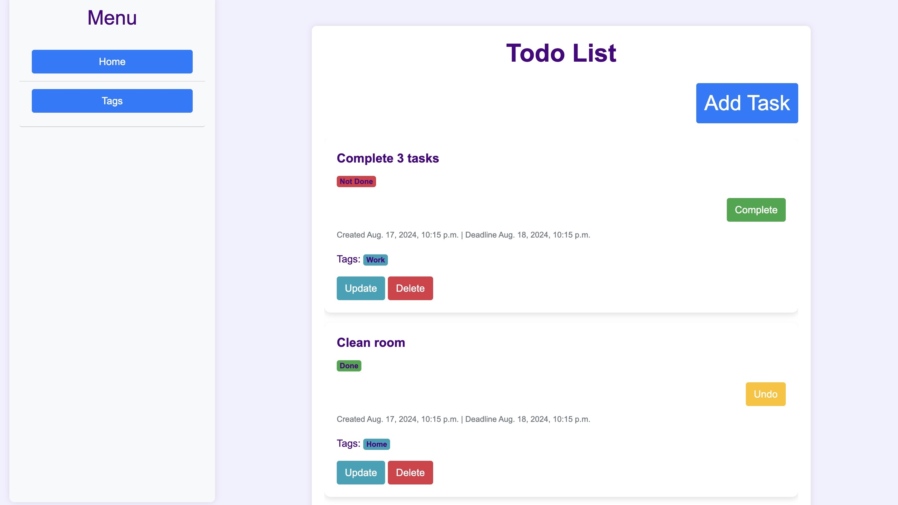
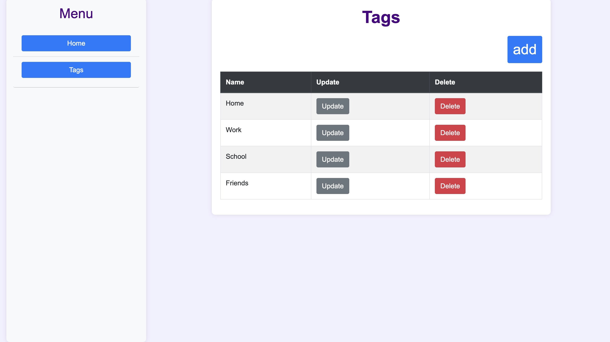
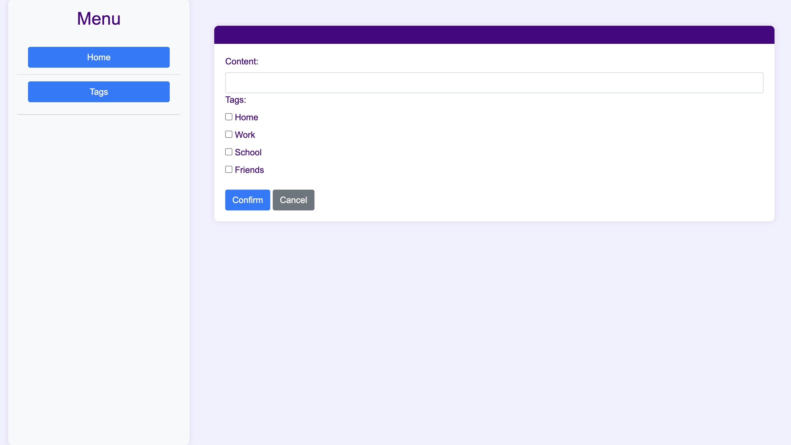

## Todo-List-project
# Basic CRUD functionality

## Installation
```
git clone https://github.com/Unlie9/Todo-List-project.git
cd Todo-List-project
python -m venv venv
pip install requirements.txt
python manage.py runserver
```

## Interface



